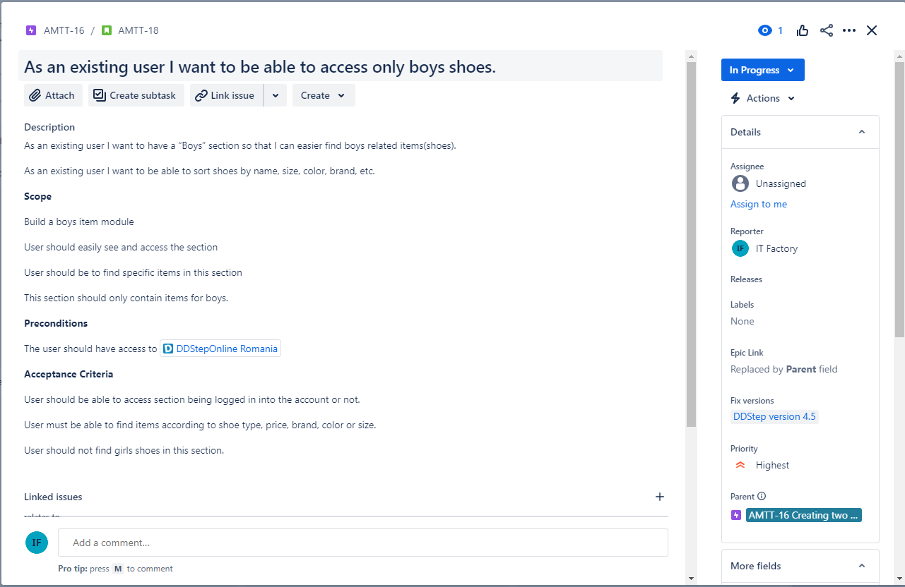
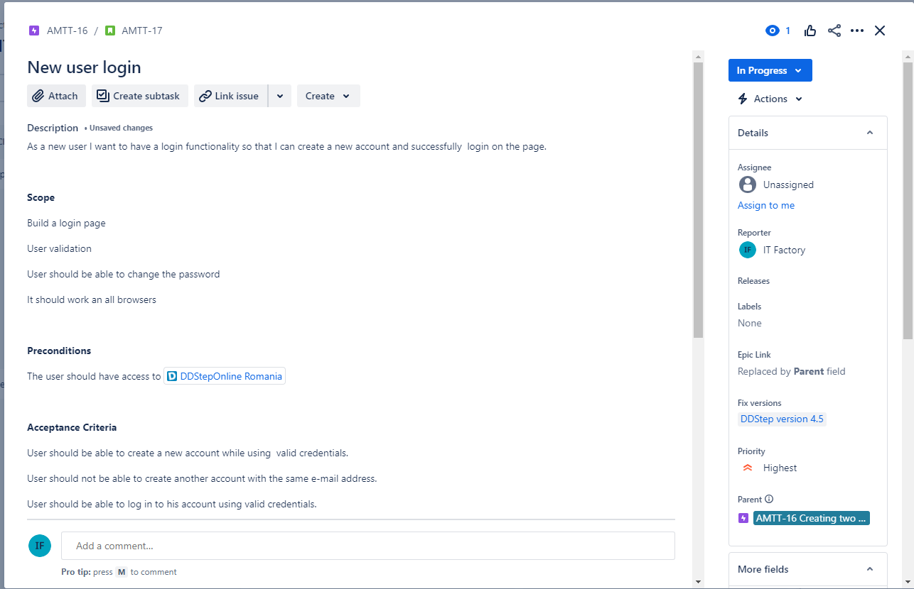
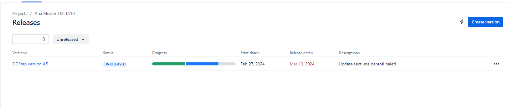
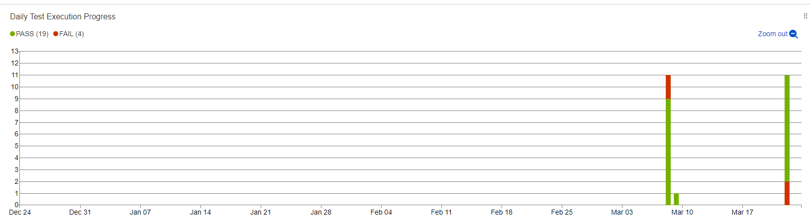
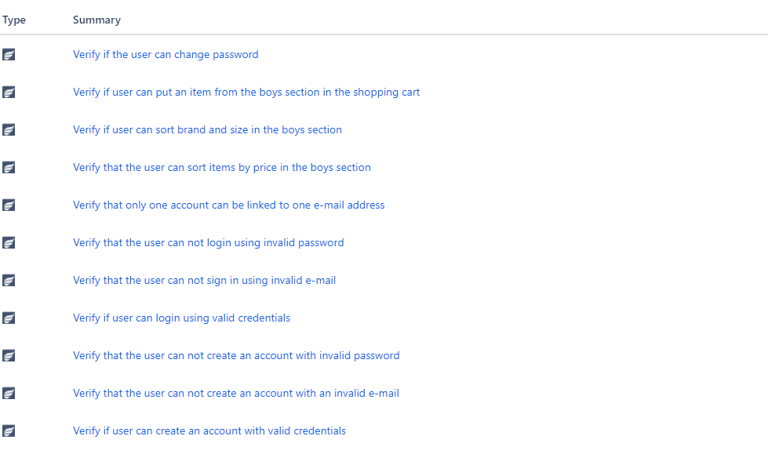
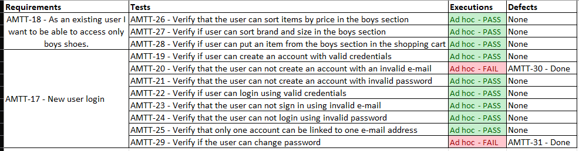
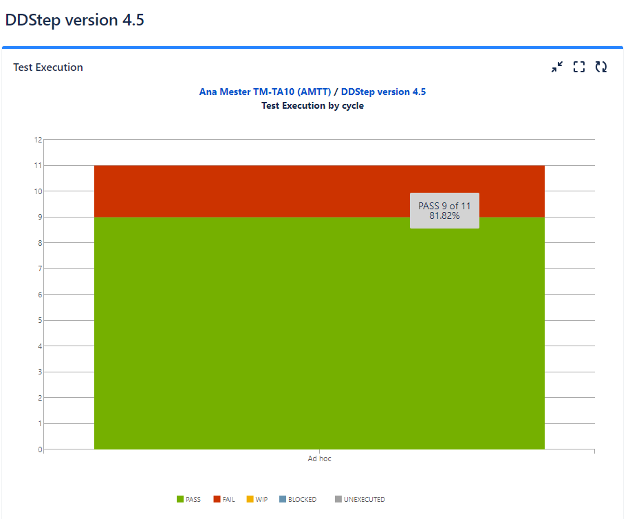

<h1>Testing Project for DDStepOnlineRomania</h1>

The scope of the final project for ITF Manual Testing Course is to use all gained knowledge throught the course and apply them in practice, using a live application

Application under test: DDStepOnlineRomania

Tools used: Jira, Zephyr Squad.

<h2>Functional specifications:</h2>

The below stories were created in Jira and describe the functional specifications of the "Login" module and the "Boys" module, for which the final project is performed upon.

Here you can find the release that was created for this project:

<h2>Testing process</h2>

The test process was performed based on the standard test process as described below.

<h3>1.1 Test planning</h3>

The Test Plan is designed to describe all details of testing for all the modules from the DDStepOnlineRomania application.

The plan identifies the items to be tested, the features to be tested, the types of testing to be performed, the personnel responsible for testing, the resources and schedule required to complete testing, and the risks associated with the plan. The test plan that was created for this project can be found [HERE](TestPlan/TestDDStep.pdf)

<h4>1.1.1. Roles asigned to the project and persons allocated</h4>

<ul>
  <li>Project manager</li> Andrea Matei
  <li>Product owner</li> Adrian Ionescu
  <li>Software developer</li> Ovidiu Alexandru
  <li>QA Engineer</li> Anamaria Marta
</ul>

<h4> 1.1.2 Entry criteria defined </h4>

•	smoke test passed (being the most basic type of test, this is a very important entry criteria in the process of testing)
•	testing environment is up and running

<h4> 1.1.3 Exit criteria defined </h4>

•	90% of tests are passed
•	no Critical issues have Open status
•	update tests are 100% passed (update tests will not generate other new issues that impact the application)

<h4> 1.1.4 Test scope</h4>

<h5> Tests in scope: </h5>

The Login and Boys module will be tested.
Web testing will be performed on different browsers.
The ability of the user to create and sign in into account will be tested
The ability of the user to find items in the Boys section will be tested, filters and the ability to put items in the cart.
Testing will be done with positive and negative values.
Retesting after bug fixes will be performed.
Regression testing will be performed.

<h5>Tests not in scope: </h5>

No QA support for mobile applications developed. Only web applications will be tested.

<h4>1.1.5 Risks detected</h4>

<h5>Project risks:</h5>

- Failure to meet the deadline
- Inexperienced employees
- Reduced number of staff
- Human resources unavailable/medical leave
- Inefficient allocation of resources
- Out of date equipment/laptops

<h5> Product risks: </h5>

- Inability to meet customer requirements
- The user's lack of trust in the website
- Security of personal data
- Low quality of non-functional parameters
- Incompatibility with Android/Ios device
- Cross-platform compatibility

<h4>1.1.6 Evaluating entry criteria</h4>

The entry criteria defined in the Test Planning phase have been achieved and the test process can continue.

<h3>1.2 Test Monitoring and Control<h3>

Test monitoring helps in identifying and managing risks associated with the testing process.

Test monitoring and control steps:

-  Create Monitoring Plan
-  Update progress record
-  Analyze record and make the adjustment
-  Produce the report

Test status report:

<h3>1.3 Test Analysis</h3>
The testing process will be executed based on the application requirements. <b>   

The following test conditions were found:  

<h3>1.4 Test Design</h3>

Functional test cases were created in Zephyr Squad based on the analysis of the specifications. 
The test cases can be accessed [HERE](https://github.com/AnaMMarta/ITF-final-project/tree/main/GIT/tests)

<h3>1.5 Test Implementation</h3>

The following elements are needed to be ready before the test execution phase begins:

- test data
- testing environment
- prioritization and grouping of tests

<h3>1.6. Test Execution </h3>

Test cases are executed on the created test Cycle summary: DDStep version 4.5

Bugs have been created based on the failed tests. The complete bug reports can be found [HERE](https://github.com/AnaMMarta/ITF-final-project/tree/main/GIT/bug)

The following is a summary of the bugs that have been found

•	The user can create an account with an invalid e-mail, priority high, severity moderate
•	The option to change the user's password is missing from the account page, priority high, severity moderate

Full regression testing is needed on the impacted areas after the bugs are fixed and retesting will be done for every functionality that was previously failed.

1.7 Test Completion
As the Exit criteria were met and satisfied as mentioned in the appropriate section, this feature is suggested to ‘Go Live’ by the Testing team

The traceability matrix was generated and can be found here: 

Test execution chart was generated and can be found below. 

The final report shows that a number 2 tests have failed of a total of 11.

11 tests were written, resulting in 2 bug reports.
The 2 discovered bugs affect the Login module, their priority is high and they are of major severity, they create confusion and mistrust for
the end user, which negatively impacts the image and activity of the manufacturer.

After the bugs will be fixed full regression testing will be performed.

Lessons learned can be found [HERE](https://github.com/AnaMMarta/ITF-final-project/blob/main/GIT/Lessons/LessonsLearned.pdf)

